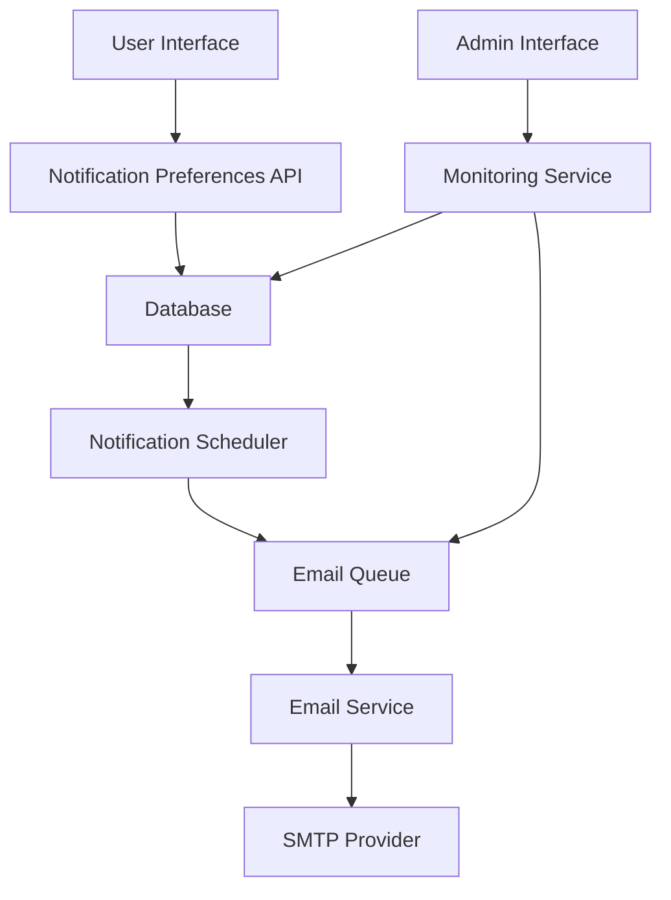

# Design Document

## Overview

The email notification system provides automated email summaries and task reminders for the Todo Management SaaS application. The system consists of four main components: an Email Service for sending emails, a Notification Scheduler for timing delivery, enhanced User Preferences for configuration, and an Administrative Interface for monitoring.

## Architecture

The email notification system follows a modular architecture with clear separation of concerns:



### Core Components

1. **Email Service**: Handles email composition, template rendering, and SMTP delivery
2. **Notification Scheduler**: Manages timing and scheduling of email notifications
3. **Email Queue**: Processes email sending with retry logic and rate limiting
4. **Monitoring Service**: Provides administrative oversight and system health metrics
5. **Enhanced Preferences**: Extended user preference system for notification configuration

## Components and Interfaces

### Email Service (`src/lib/email-service.ts`)

```typescript
interface EmailService {
  // Summary email generation
  generateSummaryEmail(userId: string, frequency: 'daily' | 'weekly'): Promise<EmailContent>
  
  // Reminder email generation
  generateReminderEmail(taskId: string): Promise<EmailContent>
  
  // Email sending with retry logic
  sendEmail(to: string, subject: string, content: EmailContent): Promise<EmailResult>
  
  // Template rendering
  renderTemplate(templateName: string, data: any): Promise<string>
}

interface EmailContent {
  html: string
  text: string
  subject: string
}

interface EmailResult {
  success: boolean
  messageId?: string
  error?: string
  retryCount: number
}
```

### Notification Scheduler (`src/lib/notification-scheduler.ts`)

```typescript
interface NotificationScheduler {
  // Schedule summary emails
  scheduleSummaryEmails(): Promise<void>
  
  // Schedule reminder emails for tasks
  scheduleReminderEmails(): Promise<void>
  
  // Process scheduled notifications
  processScheduledNotifications(): Promise<void>
  
  // Cancel scheduled notifications
  cancelTaskReminders(taskId: string): Promise<void>
}

interface ScheduledNotification {
  id: string
  userId: string
  type: 'summary' | 'reminder'
  scheduledFor: Date
  data: any
  status: 'pending' | 'sent' | 'failed'
}
```

### Enhanced User Preferences

```typescript
interface EmailNotificationPreferences {
  // Summary email settings
  summaryEnabled: boolean
  summaryFrequency: 'daily' | 'weekly'
  
  // Reminder settings
  remindersEnabled: boolean
  defaultReminderDays: number // 1-30 days before due date
  
  // Global email settings
  emailNotificationsEnabled: boolean
}

// Extended task model
interface TaskWithReminders extends Task {
  reminderEnabled: boolean
  reminderDays?: number
}
```

### Administrative Interface (`src/app/admin/`)

```typescript
interface AdminDashboard {
  // System statistics
  getUserStats(): Promise<UserStatistics>
  getEmailStats(): Promise<EmailStatistics>
  getSystemHealth(): Promise<SystemHealth>
  
  // Email monitoring
  getEmailQueue(): Promise<EmailQueueStatus>
  getFailedEmails(): Promise<FailedEmail[]>
  retryFailedEmails(emailIds: string[]): Promise<void>
}

// Admin navigation component
interface AdminNavigation {
  // Show admin panel link in main navigation
  showAdminPanelLink(userEmail: string): boolean
  
  // Admin panel access control
  isAdminUser(userEmail: string): boolean
}

interface UserStatistics {
  totalUsers: number
  activeUsers: number
  averageTasksPerUser: number
  usersWithEmailEnabled: number
}

interface EmailStatistics {
  emailsSentToday: number
  emailsSentThisWeek: number
  deliveryRate: number
  bounceRate: number
  averageDeliveryTime: number
}
```

## Data Models

### Database Schema Extensions

```sql
-- Add admin role to users table
ALTER TABLE "User" ADD COLUMN "isAdmin" BOOLEAN DEFAULT FALSE;

-- Create email notifications table
CREATE TABLE "EmailNotification" (
  "id" TEXT PRIMARY KEY,
  "userId" TEXT NOT NULL,
  "tenantId" TEXT NOT NULL,
  "type" TEXT NOT NULL, -- 'summary' | 'reminder'
  "scheduledFor" TIMESTAMP NOT NULL,
  "sentAt" TIMESTAMP,
  "status" TEXT NOT NULL DEFAULT 'pending', -- 'pending' | 'sent' | 'failed'
  "data" JSONB,
  "error" TEXT,
  "retryCount" INTEGER DEFAULT 0,
  "createdAt" TIMESTAMP DEFAULT NOW(),
  "updatedAt" TIMESTAMP DEFAULT NOW(),
  
  FOREIGN KEY ("userId") REFERENCES "User"("id") ON DELETE CASCADE,
  INDEX "idx_email_notifications_scheduled" ("scheduledFor", "status"),
  INDEX "idx_email_notifications_user" ("userId", "type")
);

-- Add reminder fields to tasks table
ALTER TABLE "Task" ADD COLUMN "reminderEnabled" BOOLEAN DEFAULT FALSE;
ALTER TABLE "Task" ADD COLUMN "reminderDays" INTEGER;

-- Update user preferences schema to include email settings
-- (This will be handled in the preferences JSONB field)
```

### Email Templates

```typescript
interface EmailTemplateData {
  // Summary email data
  summaryData: {
    user: { name: string, email: string }
    period: string // "today" | "this week"
    focusTasks: Task[]
    upcomingTasks: Task[]
    completedTasks: Task[]
    taskCounts: {
      focus: number
      upcoming: number
      completed: number
    }
  }
  
  // Reminder email data
  reminderData: {
    user: { name: string, email: string }
    task: Task
    daysUntilDue: number
    dueDate: string
  }
}
```

## Correctness Properties

*A property is a characteristic or behavior that should hold true across all valid executions of a system-essentially, a formal statement about what the system should do. Properties serve as the bridge between human-readable specifications and machine-verifiable correctness guarantees.*

### Property 1: Email Scheduling Consistency
*For any* user with email summaries enabled, scheduling a summary email should result in exactly one pending notification for the next scheduled time
**Validates: Requirements 1.3, 1.4**

### Property 2: Timezone Accuracy
*For any* user timezone setting, emails scheduled for 6am local time should be delivered within the 6:00-6:05am window in that timezone
**Validates: Requirements 1.3, 1.4, 4.1**

### Property 3: Task Reminder Cancellation
*For any* task that is completed or has its due date removed, all pending reminder notifications for that task should be cancelled
**Validates: Requirements 3.4, 3.5**

### Property 4: Email Content Completeness
*For any* summary email generated, it should contain all three required sections (Focus, Upcoming, Completed) even if some sections are empty
**Validates: Requirements 2.1, 2.5**

### Property 5: Preference Persistence
*For any* user preference update, the new settings should be immediately applied to future scheduled notifications
**Validates: Requirements 5.4, 5.5**

### Property 6: Admin Access Control
*For any* user login, admin interface access should only be granted to arvind8mathur@gmail.com
**Validates: Requirements 11.1**

### Property 7: Email Retry Logic
*For any* failed email delivery, the system should retry up to 3 times with exponential backoff before marking as permanently failed
**Validates: Requirements 4.4, 9.1**

### Property 8: Task Sorting Consistency
*For any* task list in email summaries, tasks should be sorted according to the user's configured sorting preferences
**Validates: Requirements 2.6**

### Property 9: Reminder Timing Accuracy
*For any* task with reminders enabled, the reminder email should be scheduled for exactly the configured number of days before the due date at 6am local time
**Validates: Requirements 3.2, 4.1**

### Property 11: Admin UI Navigation
*For any* user session, the admin panel link should only be visible in the navigation when the logged-in user is arvind8mathur@gmail.com
**Validates: Requirements 11.1**
### Property 10: Email Security
*For any* email sent by the system, it should only be delivered to the verified email address of the task owner
**Validates: Requirements 8.2**

### Property 11: Admin UI Navigation
*For any* user session, the admin panel link should only be visible in the navigation when the logged-in user is arvind8mathur@gmail.com
**Validates: Requirements 11.1**

## Error Handling

### Email Delivery Failures
- **SMTP Connection Errors**: Retry with exponential backoff (1s, 2s, 4s)
- **Authentication Failures**: Log error and disable email service temporarily
- **Rate Limiting**: Implement queue throttling and respect provider limits
- **Invalid Email Addresses**: Mark as permanently failed, don't retry

### Scheduling Errors
- **Timezone Conversion Failures**: Fall back to UTC and log warning
- **Database Connection Issues**: Queue notifications in memory temporarily
- **Invalid User Preferences**: Use default settings and notify user

### Template Rendering Errors
- **Missing Template Data**: Use fallback values and log warning
- **Template Compilation Errors**: Use plain text fallback
- **Large Email Content**: Truncate content with "view full details" link

## Testing Strategy

### Unit Tests
- Email template rendering with various data scenarios
- Timezone conversion accuracy across different timezones
- SMTP configuration validation and error handling
- User preference validation and default value handling

### Property-Based Tests
- **Email Scheduling**: Generate random user timezones and verify 6am delivery scheduling
- **Task Reminder Calculation**: Generate random due dates and reminder days, verify correct scheduling
- **Email Content Generation**: Generate random task lists and verify complete email structure
- **Admin Access Control**: Generate random email addresses and verify only admin gets access

### Integration Tests
- End-to-end email delivery with test SMTP server
- Database notification scheduling and retrieval
- User preference updates affecting scheduled notifications
- Admin dashboard data accuracy and real-time updates

### Load Testing
- 1000+ concurrent summary email generation
- High-volume reminder email scheduling
- Email queue processing under load
- Database performance with large notification tables

## Performance Considerations

### Email Generation Optimization
- **Template Caching**: Cache compiled email templates in memory
- **Batch Processing**: Generate multiple emails in single database queries
- **Lazy Loading**: Only load task details needed for email content
- **Connection Pooling**: Reuse SMTP connections for multiple emails

### Database Optimization
- **Indexing**: Optimize queries for scheduled notification retrieval
- **Partitioning**: Partition notification table by date for better performance
- **Cleanup**: Automatically purge old notification records (>30 days)
- **Caching**: Cache user preferences and timezone data

### Scalability Architecture
- **Queue-Based Processing**: Use Redis or database queues for email processing
- **Horizontal Scaling**: Support multiple worker processes for email sending
- **Rate Limiting**: Implement per-user and global rate limits
- **Monitoring**: Track email queue depth and processing times

## Security Considerations

### Email Content Security
- **Data Sanitization**: Escape all user-generated content in emails
- **Access Control**: Verify user ownership before including task data
- **Encryption**: Use TLS for all SMTP connections
- **Audit Logging**: Log email sending activities without content

### Administrative Security
- **Role-Based Access**: Restrict admin interface to authorized users only
- **Session Management**: Implement secure admin session handling
- **Audit Trail**: Log all administrative actions with timestamps
- **Data Privacy**: Ensure admin interface doesn't expose sensitive user data

### Configuration Security
- **Environment Variables**: Store SMTP credentials securely
- **Connection Validation**: Validate SMTP settings before use
- **Error Handling**: Don't expose internal errors to users
- **Backup Plans**: Graceful degradation when email service is unavailable