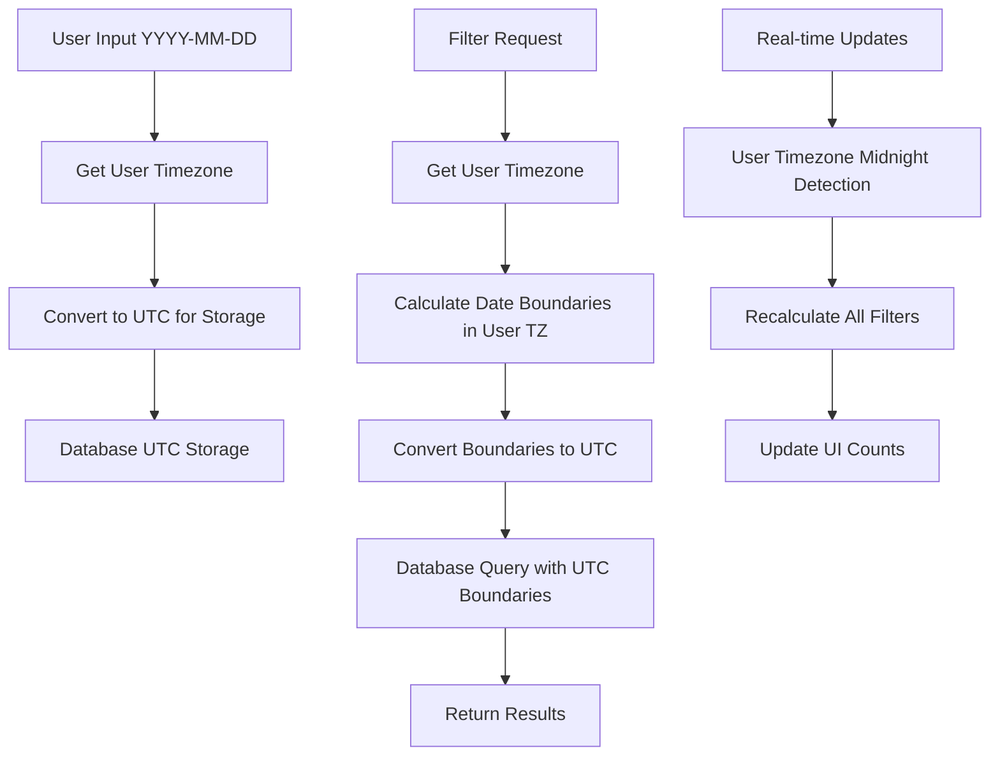

# Design Document

## Overview

This design addresses critical task filtering issues in the Todo Management SaaS application where date-based filters are not working correctly due to timezone handling problems. The system currently shows incorrect task counts and displays tasks in wrong filter categories because it uses server timezone instead of user timezone for date calculations.

The solution involves implementing proper timezone-aware date handling throughout the system while maintaining the existing database schema (which correctly stores dates in UTC). The key insight is that all date comparisons and filtering logic must be performed using the user's timezone, not the server's timezone.

## Architecture

### Current Architecture Issues

1. **Date Creation**: API routes create dates using `new Date(year, month-1, day)` which uses server timezone
2. **Date Filtering**: Database queries use UTC dates but don't account for user timezone when calculating "today"
3. **Task Utilities**: Date comparison functions use server timezone instead of user timezone
4. **Missing User Timezone**: Most operations don't retrieve or use user timezone preferences

### Proposed Architecture



### Timezone Handling Strategy

1. **Storage**: All dates stored in UTC (already implemented in database schema)
2. **Input Processing**: Convert user input dates from user timezone to UTC before storage
3. **Filtering**: Calculate date boundaries in user timezone, then convert to UTC for database queries
4. **Display**: Convert UTC dates to user timezone for display (handled by frontend)
5. **Real-time Updates**: Detect midnight in user timezone and refresh filters

## Components and Interfaces

### 1. Timezone Utility Service

```typescript
interface TimezoneService {
  // Get user's timezone preference with fallback
  getUserTimezone(userId: string): Promise<string>
  
  // Convert date from user timezone to UTC for storage
  convertToUTC(dateString: string, userTimezone: string): Date
  
  // Get current date in user's timezone
  getCurrentDateInTimezone(userTimezone: string): Date
  
  // Calculate date boundaries for filtering
  getDateBoundaries(userTimezone: string): {
    todayStart: Date
    todayEnd: Date
    tomorrowStart: Date
    weekFromNow: Date
  }
  
  // Check if it's midnight in user timezone
  isMidnightInTimezone(userTimezone: string): boolean
}
```

### 2. Enhanced Task Filtering Service

```typescript
interface TaskFilterService {
  // Get tasks with timezone-aware filtering
  getFilteredTasks(
    tenantId: string,
    userId: string,
    filters: TaskFilters,
    userTimezone: string
  ): Promise<TaskResult>
  
  // Get filter counts with timezone awareness
  getFilterCounts(
    tenantId: string,
    userId: string,
    userTimezone: string,
    completedTaskWindow: number
  ): Promise<FilterCounts>
  
  // Real-time filter updates
  refreshFiltersForTimezone(userTimezone: string): Promise<void>
}

interface FilterCounts {
  all: number
  focus: number
  today: number
  overdue: number
  upcoming: number
  noDueDate: number
}
```

### 3. Updated API Route Interfaces

```typescript
// Enhanced task creation with timezone handling
interface CreateTaskRequest {
  title: string
  description?: string
  priority: TaskPriority
  dueDate?: string // YYYY-MM-DD format
  // ... other fields
}

// Enhanced task filtering with timezone
interface TaskFilterRequest {
  dueDate?: "today" | "overdue" | "upcoming" | "no-due-date" | "focus"
  includeCompleted?: "1" | "7" | "30" // days
  // ... other filters
}
```

### 4. Real-time Update Service

```typescript
interface RealtimeUpdateService {
  // Schedule midnight updates for all active users
  scheduleTimezoneUpdates(): void
  
  // Process midnight update for specific timezone
  processMidnightUpdate(timezone: string): Promise<void>
  
  // Notify clients of filter changes
  notifyFilterUpdates(userIds: string[], updates: FilterCounts): void
}
```

## Data Models

### User Preferences Enhancement

The existing `User.preferences` JSON field will be enhanced to include timezone:

```typescript
interface UserPreferences {
  timezone: string // IANA timezone identifier (e.g., "Asia/Singapore")
  completedTaskVisibility: 1 | 7 | 30 // days
  gtdEnabled: boolean
  // ... other preferences
}
```

### Task Model (No Changes Required)

The existing Task model already stores dates in UTC correctly:

```typescript
interface Task {
  dueDate: DateTime? // Stored in UTC
  originalDueDate: DateTime? // Stored in UTC  
  completedAt: DateTime? // Stored in UTC
  // ... other fields
}
```

## Correctness Properties

*A property is a characteristic or behavior that should hold true across all valid executions of a system-essentially, a formal statement about what the system should do. Properties serve as the bridge between human-readable specifications and machine-verifiable correctness guarantees.*

### Property 1: Timezone-aware Today Calculation
*For any* user timezone and current timestamp, calculating "today" should return the correct date in that user's timezone, not the server timezone
**Validates: Requirements 1.1, 5.1**

### Property 2: Today Filter Accuracy
*For any* set of tasks and user timezone, the Today filter should include exactly those tasks with due dates matching the current date in the user's timezone
**Validates: Requirements 1.2**

### Property 3: Focus Filter Composition
*For any* set of tasks, user timezone, and completed task preference, the Focus filter count should equal the sum of Today tasks plus Overdue tasks plus recently completed tasks
**Validates: Requirements 2.6, 6.5**

### Property 4: Upcoming Filter Exclusivity
*For any* set of tasks and user timezone, the Upcoming filter should include only tasks with due dates after the current date in the user's timezone
**Validates: Requirements 3.1**

### Property 5: Completed Task Visibility Consistency
*For any* user preference setting (1, 7, or 30 days), completed tasks within that window should appear in all relevant filters (All Tasks, Today, Focus, Overdue, Upcoming)
**Validates: Requirements 4.1**

### Property 6: Completed Task Sort Order
*For any* filter that includes completed tasks, completed tasks should always appear at the end of the list, after all active tasks
**Validates: Requirements 4.6**

### Property 7: UTC Storage with Timezone Interpretation
*For any* date input in YYYY-MM-DD format and user timezone, the date should be stored in UTC but interpreted correctly in the user's timezone for filtering
**Validates: Requirements 5.4, 5.5, 11.1**

### Property 8: Filter Count Accuracy
*For any* set of tasks and filter criteria, the displayed filter count should exactly match the number of tasks returned by that filter
**Validates: Requirements 6.1**

### Property 9: Overdue Identification
*For any* task with a due date and user timezone, the task should be marked as overdue if and only if its due date is before the current date in the user's timezone and the task is not completed
**Validates: Requirements 7.1**

### Property 10: No Due Date Filter Exclusivity
*For any* task without a due date, it should appear in the "No Due Date" filter and All Tasks filter, but not in any date-based filters (Today, Overdue, Upcoming)
**Validates: Requirements 8.1, 8.3**

### Property 11: Timezone Boundary Calculations
*For any* user timezone, date range filtering (today, overdue, upcoming) should calculate boundaries using that timezone, not server timezone
**Validates: Requirements 11.2**

### Property 12: Midnight Filter Updates
*For any* user timezone, when the date changes at midnight in that timezone, all filter counts and categorizations should be recalculated automatically
**Validates: Requirements 9.1**

## Error Handling

### Timezone Handling Errors

1. **Invalid Timezone**: If user has invalid timezone preference, fall back to UTC
2. **Missing Timezone**: If user has no timezone preference, detect from browser or default to UTC
3. **Timezone Conversion Errors**: Log errors and fall back to server timezone with warning

### Date Parsing Errors

1. **Invalid Date Format**: Return clear error message for invalid YYYY-MM-DD input
2. **Out of Range Dates**: Handle dates outside reasonable ranges (1900-2100)
3. **Leap Year Handling**: Ensure February 29th is handled correctly

### Database Query Errors

1. **Connection Failures**: Retry with exponential backoff
2. **Query Timeouts**: Use optimized queries with proper indexing
3. **Concurrent Updates**: Handle race conditions in filter count updates

### Real-time Update Errors

1. **Midnight Detection Failures**: Implement fallback polling mechanism
2. **Notification Failures**: Queue updates for retry
3. **Timezone Change Handling**: Detect and handle user timezone changes

## Testing Strategy

### Dual Testing Approach

The system will use both unit tests and property-based tests to ensure comprehensive coverage:

- **Unit tests**: Verify specific examples, edge cases, and error conditions
- **Property tests**: Verify universal properties across all inputs using randomized testing
- Both approaches are complementary and necessary for comprehensive validation

### Property-Based Testing Configuration

- **Testing Framework**: fast-check (already configured in the project)
- **Minimum Iterations**: 100 iterations per property test
- **Test Tagging**: Each property test references its design document property
- **Tag Format**: **Feature: task-filtering-fixes, Property {number}: {property_text}**

### Unit Testing Focus Areas

Unit tests will focus on:
- Specific timezone edge cases (DST transitions, leap years)
- Error conditions and fallback behavior
- Integration points between components
- Midnight boundary conditions
- Filter count consistency checks

### Property Testing Focus Areas

Property tests will focus on:
- Universal timezone conversion correctness
- Filter accuracy across all possible task combinations
- Mathematical relationships between filter counts
- Sort order consistency
- Date boundary calculations

### Test Data Generation

Property tests will generate:
- Random IANA timezone identifiers
- Random dates across multiple years
- Random task sets with various due dates and completion states
- Random user preferences (1, 7, 30 day windows)
- Random timestamps around midnight boundaries

### Performance Testing

- **Filter Response Time**: All filters must respond within 200ms
- **Concurrent User Load**: Test with 100+ users in different timezones
- **Database Query Optimization**: Ensure proper indexing for timezone-aware queries
- **Memory Usage**: Monitor memory usage during real-time updates

## Implementation Notes

### Database Indexing

Existing indexes are sufficient since we're not changing the database schema:
- `Task.dueDate` index for date range queries
- `Task.completedAt` index for completed task filtering
- `Task.status` index for active/completed filtering

### Caching Strategy

- **User Timezone Cache**: Cache user timezone preferences for 1 hour
- **Filter Count Cache**: Cache filter counts for 5 minutes with timezone-aware keys
- **Date Boundary Cache**: Cache date boundaries for 1 hour per timezone

### Migration Strategy

1. **Phase 1**: Implement timezone utility service
2. **Phase 2**: Update API routes to use timezone-aware date handling
3. **Phase 3**: Update database service with timezone-aware filtering
4. **Phase 4**: Implement real-time updates
5. **Phase 5**: Add comprehensive testing

### Backward Compatibility

- Existing tasks with dates will continue to work (already stored in UTC)
- Users without timezone preferences will default to UTC
- API responses maintain the same format
- No database schema changes required

<function_calls>
<invoke name="prework">
<parameter name="featureName">task-filtering-fixes