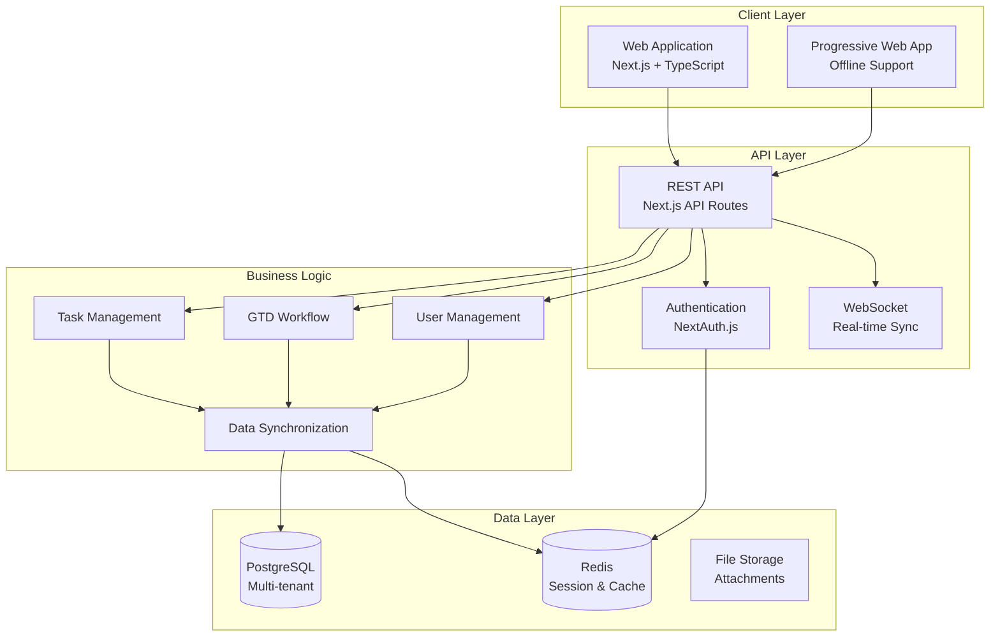
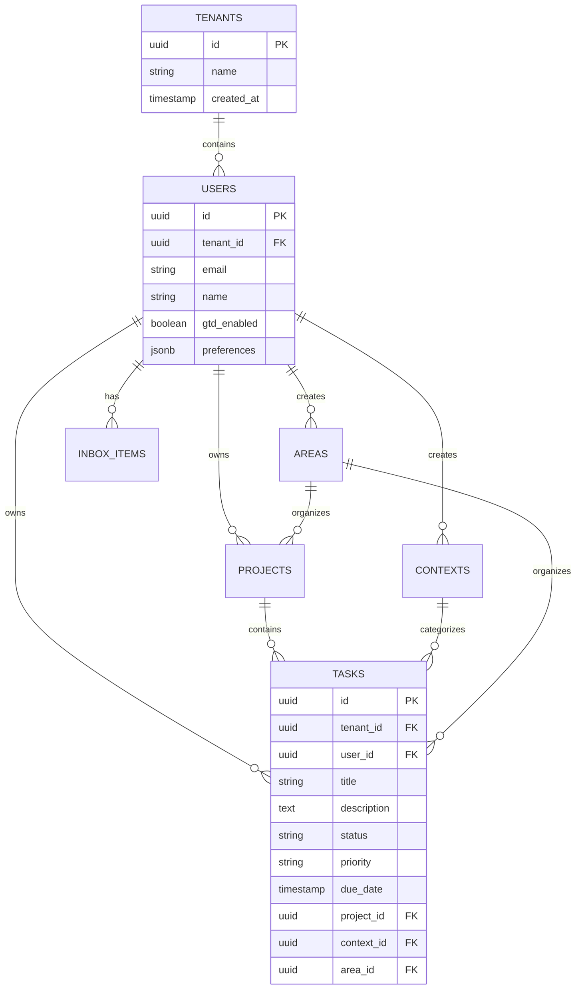

# Design Document: Todo Management SaaS

## Overview

This design outlines a modern web-based SaaS application for to-do list management that serves both casual users and advanced users implementing the Getting Things Done (GTD) methodology. The system uses a progressive disclosure approach, starting with simple task management and allowing users to enable advanced GTD features as needed.

The application follows modern SaaS architecture patterns with multi-tenant isolation, real-time synchronization, and a responsive web interface built with Next.js and TypeScript.

## Architecture

### High-Level Architecture



### Technology Stack

- **Frontend**: Next.js 14 with App Router, TypeScript, Tailwind CSS
- **Backend**: Next.js API Routes, Node.js runtime
- **Database**: PostgreSQL with row-level security for multi-tenancy
- **Caching**: Redis for sessions and frequently accessed data
- **Authentication**: NextAuth.js with multiple providers
- **Real-time**: WebSocket connections for live synchronization
- **Deployment**: Vercel or similar serverless platform

### Multi-Tenant Architecture

The system implements a **shared database, shared schema** approach with logical isolation:

- Each table includes a `tenant_id` column for data isolation
- Row-level security policies enforce tenant boundaries
- All queries automatically filter by the authenticated user's tenant
- Audit logging tracks all operations with tenant context

## Components and Interfaces

### Core Data Models

```typescript
// User and Tenant Models
interface User {
  id: string;
  email: string;
  name: string;
  tenantId: string;
  gtdEnabled: boolean;
  preferences: UserPreferences;
  createdAt: Date;
  updatedAt: Date;
}

interface UserPreferences {
  completedTaskVisibility: 'none' | '1day' | '7days' | '30days'; // Completed task toggle options
  defaultView: 'simple' | 'gtd';
  theme: 'light' | 'dark' | 'system';
  notifications: NotificationSettings;
}

// Task Management Models
interface Task {
  id: string;
  tenantId: string;
  title: string;
  description?: string;
  status: TaskStatus;
  priority: Priority;
  dueDate?: Date;
  originalDueDate?: Date;  // Preserves initial due date for historical tracking
  completedAt?: Date;
  projectId?: string;
  contextId?: string;
  areaId?: string;
  tags: string[];
  createdAt: Date;
  updatedAt: Date;
}

type TaskStatus = 'active' | 'completed' | 'archived' | 'deleted';
type Priority = 'low' | 'medium' | 'high' | 'urgent';

// GTD-Specific Models
interface Project {
  id: string;
  tenantId: string;
  name: string;
  description?: string;
  status: ProjectStatus;
  areaId?: string;
  outcome?: string;
  nextActionId?: string;
  createdAt: Date;
  updatedAt: Date;
}

type ProjectStatus = 'active' | 'someday' | 'completed' | 'archived';

interface Context {
  id: string;
  tenantId: string;
  name: string;
  description?: string;
  icon?: string;
  isDefault: boolean;
}

interface Area {
  id: string;
  tenantId: string;
  name: string;
  description?: string;
  color?: string;
}

interface InboxItem {
  id: string;
  tenantId: string;
  content: string;
  processed: boolean;
  processedAt?: Date;
  createdAt: Date;
}
```

### Service Interfaces

```typescript
// Task Management Service
interface TaskService {
  createTask(task: CreateTaskRequest): Promise<Task>;
  updateTask(id: string, updates: UpdateTaskRequest): Promise<Task>;
  deleteTask(id: string): Promise<void>;
  completeTask(id: string): Promise<Task>;
  getTasks(filters: TaskFilters): Promise<Task[]>;
  searchTasks(query: string): Promise<Task[]>;
}

// GTD Workflow Service
interface GTDService {
  addToInbox(content: string): Promise<InboxItem>;
  processInboxItem(id: string, action: ProcessingAction): Promise<void>;
  getInboxItems(): Promise<InboxItem[]>;
  conductWeeklyReview(): Promise<ReviewData>;
  getContextTasks(contextId: string): Promise<Task[]>;
  getAreaProjects(areaId: string): Promise<Project[]>;
}

// Synchronization Service
interface SyncService {
  syncUserData(userId: string): Promise<SyncResult>;
  handleOfflineChanges(changes: OfflineChange[]): Promise<ConflictResolution[]>;
  broadcastChange(change: DataChange): Promise<void>;
}
```

### API Endpoints

```typescript
// REST API Routes
GET    /api/tasks              // Get user's tasks with filters
POST   /api/tasks              // Create new task
PUT    /api/tasks/:id          // Update task
DELETE /api/tasks/:id          // Delete task
POST   /api/tasks/:id/complete // Mark task complete

GET    /api/projects           // Get user's projects
POST   /api/projects           // Create new project
PUT    /api/projects/:id       // Update project

GET    /api/inbox              // Get inbox items
POST   /api/inbox              // Add to inbox
POST   /api/inbox/:id/process  // Process inbox item

GET    /api/contexts           // Get contexts
POST   /api/contexts           // Create context

GET    /api/areas              // Get areas
POST   /api/areas              // Create area

POST   /api/sync               // Sync data
GET    /api/sync/status        // Get sync status

// WebSocket Events
'task:created'    // New task created
'task:updated'    // Task updated
'task:completed'  // Task completed
'task:deleted'    // Task deleted
'sync:required'   // Data sync needed
```

## Data Models

### Database Schema

```sql
-- Users and Tenants
CREATE TABLE tenants (
  id UUID PRIMARY KEY DEFAULT gen_random_uuid(),
  name VARCHAR(255) NOT NULL,
  created_at TIMESTAMP DEFAULT NOW(),
  updated_at TIMESTAMP DEFAULT NOW()
);

CREATE TABLE users (
  id UUID PRIMARY KEY DEFAULT gen_random_uuid(),
  tenant_id UUID NOT NULL REFERENCES tenants(id),
  email VARCHAR(255) UNIQUE NOT NULL,
  name VARCHAR(255) NOT NULL,
  gtd_enabled BOOLEAN DEFAULT FALSE,
  preferences JSONB DEFAULT '{}',
  created_at TIMESTAMP DEFAULT NOW(),
  updated_at TIMESTAMP DEFAULT NOW()
);

-- Core Task Management
CREATE TABLE tasks (
  id UUID PRIMARY KEY DEFAULT gen_random_uuid(),
  tenant_id UUID NOT NULL REFERENCES tenants(id),
  user_id UUID NOT NULL REFERENCES users(id),
  title VARCHAR(500) NOT NULL,
  description TEXT,
  status VARCHAR(20) DEFAULT 'active',
  priority VARCHAR(20) DEFAULT 'medium',
  due_date TIMESTAMP,
  original_due_date TIMESTAMP,  -- Preserves initial due date for historical tracking
  completed_at TIMESTAMP,
  project_id UUID REFERENCES projects(id),
  context_id UUID REFERENCES contexts(id),
  area_id UUID REFERENCES areas(id),
  tags TEXT[] DEFAULT '{}',
  created_at TIMESTAMP DEFAULT NOW(),
  updated_at TIMESTAMP DEFAULT NOW()
);

-- GTD Components
CREATE TABLE projects (
  id UUID PRIMARY KEY DEFAULT gen_random_uuid(),
  tenant_id UUID NOT NULL REFERENCES tenants(id),
  user_id UUID NOT NULL REFERENCES users(id),
  name VARCHAR(255) NOT NULL,
  description TEXT,
  status VARCHAR(20) DEFAULT 'active',
  area_id UUID REFERENCES areas(id),
  outcome TEXT,
  next_action_id UUID REFERENCES tasks(id),
  created_at TIMESTAMP DEFAULT NOW(),
  updated_at TIMESTAMP DEFAULT NOW()
);

CREATE TABLE contexts (
  id UUID PRIMARY KEY DEFAULT gen_random_uuid(),
  tenant_id UUID NOT NULL REFERENCES tenants(id),
  user_id UUID NOT NULL REFERENCES users(id),
  name VARCHAR(100) NOT NULL,
  description TEXT,
  icon VARCHAR(50),
  is_default BOOLEAN DEFAULT FALSE,
  created_at TIMESTAMP DEFAULT NOW()
);

CREATE TABLE areas (
  id UUID PRIMARY KEY DEFAULT gen_random_uuid(),
  tenant_id UUID NOT NULL REFERENCES tenants(id),
  user_id UUID NOT NULL REFERENCES users(id),
  name VARCHAR(100) NOT NULL,
  description TEXT,
  color VARCHAR(7),
  created_at TIMESTAMP DEFAULT NOW()
);

CREATE TABLE inbox_items (
  id UUID PRIMARY KEY DEFAULT gen_random_uuid(),
  tenant_id UUID NOT NULL REFERENCES tenants(id),
  user_id UUID NOT NULL REFERENCES users(id),
  content TEXT NOT NULL,
  processed BOOLEAN DEFAULT FALSE,
  processed_at TIMESTAMP,
  created_at TIMESTAMP DEFAULT NOW()
);

-- Row Level Security
ALTER TABLE tasks ENABLE ROW LEVEL SECURITY;
ALTER TABLE projects ENABLE ROW LEVEL SECURITY;
ALTER TABLE contexts ENABLE ROW LEVEL SECURITY;
ALTER TABLE areas ENABLE ROW LEVEL SECURITY;
ALTER TABLE inbox_items ENABLE ROW LEVEL SECURITY;

-- Security Policies (example for tasks)
CREATE POLICY tenant_isolation_tasks ON tasks
  USING (tenant_id = current_setting('app.current_tenant_id')::UUID);
```

### Data Relationships



Now I need to use the prework tool to analyze the acceptance criteria before writing the correctness properties:

<function_calls>
<invoke name="prework">
<parameter name="featureName">todo-management

## Correctness Properties

*A property is a characteristic or behavior that should hold true across all valid executions of a system—essentially, a formal statement about what the system should do. Properties serve as the bridge between human-readable specifications and machine-verifiable correctness guarantees.*

### Property 1: Task Creation Persistence
*For any* valid task description and user, creating a task should result in that task appearing in the user's task list with the correct data preserved.
**Validates: Requirements 1.1**

### Property 2: Task Completion State Transition
*For any* active task, marking it as complete should update its status to completed and move it to the completed tasks section while preserving all task data.
**Validates: Requirements 1.2, 10.1**

### Property 3: Task Update Persistence
*For any* existing task and valid update data, modifying the task should result in the changes being saved and reflected in subsequent retrievals.
**Validates: Requirements 1.3**

### Property 4: Task Deletion Removal
*For any* existing task, deleting it should result in the task no longer appearing in any task lists or views.
**Validates: Requirements 1.4**

### Property 5: Active Task Display
*For any* user with active tasks, the system should display all active tasks in the task list view.
**Validates: Requirements 1.5**

### Property 6: Due Date and Overdue Detection
*For any* task with a due date, the system should correctly identify and highlight tasks that are overdue based on the current date.
**Validates: Requirements 2.1**

### Property 7: Filtering and Search Consistency
*For any* search query or filter criteria, the system should return only tasks that match the specified criteria (priority, status, search terms, context, area).
**Validates: Requirements 2.2, 2.3, 2.4, 4.1, 10.2**

### Property 8: Today and Overdue Views
*For any* collection of tasks with various due dates, the "today" view should show only tasks due today, and the "overdue" view should show only tasks past their due date.
**Validates: Requirements 2.5**

### Property 9: Inbox Item Storage
*For any* content added to the inbox, it should be stored as an unprocessed item and appear in the inbox with the correct unprocessed status.
**Validates: Requirements 3.1**

### Property 10: Inbox Processing Options
*For any* unprocessed inbox item, the system should provide appropriate processing options (convert to task/project/reference, delete, or file as reference).
**Validates: Requirements 3.2, 3.3**

### Property 11: Inbox Processing Cleanup
*For any* inbox item that is processed, it should be removed from the inbox view and no longer count as unprocessed.
**Validates: Requirements 3.4**

### Property 12: Inbox Counter Accuracy
*For any* state of the inbox, the displayed count of unprocessed items should accurately reflect the actual number of unprocessed items.
**Validates: Requirements 3.5**

### Property 13: Context and Area Assignment
*For any* task or project assigned to a context or area, it should appear in the appropriate context/area views and be filterable by that assignment.
**Validates: Requirements 4.1, 4.3**

### Property 14: Context Creation Availability
*For any* newly created context, it should immediately become available for assignment to tasks.
**Validates: Requirements 4.2**

### Property 15: Project Task Association
*For any* project and tasks assigned to it, the project view should display all associated tasks and calculate progress correctly.
**Validates: Requirements 5.1, 5.2, 5.5**

### Property 16: Automatic Project Completion
*For any* project where all associated tasks are completed, the project status should automatically change to completed.
**Validates: Requirements 5.3**

### Property 17: Project Deletion Options
*For any* project being deleted, the system should provide appropriate options for handling associated tasks.
**Validates: Requirements 5.4**

### Property 18: Weekly Review Presentation
*For any* user initiating a weekly review, the system should present all projects and areas for review with appropriate highlighting for incomplete items.
**Validates: Requirements 6.1, 6.2, 6.3**

### Property 19: Review Completion Tracking
*For any* completed review session, the system should record the review date and reset review indicators appropriately.
**Validates: Requirements 6.4**

### Property 20: Review Reminder Timing
*For any* user with review preferences, the system should trigger reminders at the appropriate intervals based on their last review date.
**Validates: Requirements 6.5**

### Property 21: Auto-save Timing
*For any* change made to tasks or projects, the system should save the changes within the specified time limit (2 seconds).
**Validates: Requirements 7.1**

### Property 22: Cross-device Data Consistency
*For any* user accessing the application from different devices, their data should be consistent across all devices.
**Validates: Requirements 7.2**

### Property 23: Real-time Synchronization
*For any* changes made on one device, they should be synchronized to other active devices within the specified time limit (5 seconds).
**Validates: Requirements 7.3**

### Property 24: Offline Operation and Sync Recovery
*For any* user working offline, changes should be preserved locally and synchronized when connectivity is restored.
**Validates: Requirements 7.4**

### Property 25: Save and Sync Feedback
*For any* save or sync operation, the system should provide appropriate visual feedback to indicate the operation status.
**Validates: Requirements 7.5**

### Property 26: GTD Feature Toggle
*For any* user switching between basic and GTD modes, the system should show/hide appropriate features while preserving all data and maintaining interface consistency.
**Validates: Requirements 8.2, 8.4, 8.5, 8.6**

### Property 27: GTD Onboarding
*For any* user enabling GTD features, the system should provide onboarding guidance for GTD concepts and workflows.
**Validates: Requirements 8.3**

### Property 28: Multi-tenant Data Isolation
*For any* user operation, the system should ensure complete data isolation between different users and prevent cross-user data access.
**Validates: Requirements 9.1, 9.2, 9.3, 9.5**

### Property 29: Audit Logging
*For any* system operation, appropriate audit logs should be maintained with user attribution and operation details.
**Validates: Requirements 9.4**

### Property 30: Completed Task Management
*For any* completed task, it should be properly organized by completion date, searchable, and subject to appropriate archiving rules based on age and user preferences.
**Validates: Requirements 10.2, 10.3, 10.5**

### Property 31: Completed Task Deletion Options
*For any* request to delete completed tasks, the system should provide appropriate options based on task age and user preferences.
**Validates: Requirements 10.4**

### Property 30: Enhanced Completed Task Management
*For any* completed task, it should be properly moved to the completed section with completion date recorded and remain immutable to prevent uncompleting.
**Validates: Requirements 10.1, 10.4**

### Property 31: Completed Task Visibility Toggle
*For any* completed task visibility selection (1 day, 7 days, 30 days), the system should filter both task lists and tab counts to show only completed tasks within the selected timeframe.
**Validates: Requirements 10.3**

### Property 32: Completed Task Immutability Display
*For any* completed task displayed in the interface, it should have disabled interaction controls and visual indicators showing its read-only status.
**Validates: Requirements 10.5, 12.5**

### Property 33: Original Due Date Preservation
*For any* task with a due date that gets modified, the system should preserve the original due date separately from the current due date.
**Validates: Requirements 10.6**

### Property 34: Complete Date Field Tracking
*For any* task, the system should maintain all required date fields: date created, original due date, current due date, and date completed (when applicable).
**Validates: Requirements 10.7**

### Property 35: Inline Editing Activation
*For any* task field (title, due date, priority), clicking on it should enable inline editing with immediate visual feedback.
**Validates: Requirements 12.1**

### Property 36: Date Quick Selector Functionality
*For any* task in edit mode, using date quick selectors (Today, Tomorrow, Clear) should update the date without losing focus or exiting edit mode.
**Validates: Requirements 12.2**

### Property 37: Tab Count Consistency
*For any* task filtering view, the displayed tab counts should accurately match the actual number of tasks in each filtered category using consistent timezone calculations.
**Validates: Requirements 12.4**

### Property 38: Auto-save Task Changes
*For any* task editing operation, changes should be automatically saved immediately upon completion of the editing action.
**Validates: Requirements 12.6**

### Property 39: Save Operation Visual Feedback
*For any* save or synchronization operation, the system should provide clear visual feedback indicating the operation status.
**Validates: Requirements 12.7**

### Property 40: Authentication and Validation
*For any* user registration or login attempt, the system should properly validate credentials and enforce security requirements.
**Validates: Requirements 13.1, 13.2**

### Property 41: Session Management
*For any* user session, the system should properly handle session expiration and require re-authentication when appropriate.
**Validates: Requirements 13.3**

### Property 42: Password Reset Security
*For any* password reset request, the system should send a secure reset link to the registered email address.
**Validates: Requirements 13.4**

## Error Handling

### Input Validation
- All user inputs are validated on both client and server sides
- Invalid data is rejected with clear error messages
- SQL injection and XSS attacks are prevented through parameterized queries and input sanitization

### Network and Connectivity
- Graceful degradation when offline with local storage fallback
- Retry mechanisms for failed API calls with exponential backoff
- Connection status indicators and user notifications

### Data Consistency
- Optimistic locking for concurrent updates
- Conflict resolution strategies for sync conflicts
- Transaction rollback for failed operations

### Authentication and Authorization
- Secure session management with automatic expiration
- Rate limiting for authentication attempts
- Proper error messages that don't leak security information

### System Errors
- Comprehensive error logging with correlation IDs
- Graceful error boundaries in React components
- User-friendly error messages with actionable guidance

## Testing Strategy

### Dual Testing Approach

The system will use both **unit tests** and **property-based tests** as complementary testing strategies:

- **Unit tests**: Verify specific examples, edge cases, and error conditions
- **Property tests**: Verify universal properties across all inputs
- Together they provide comprehensive coverage where unit tests catch concrete bugs and property tests verify general correctness

### Property-Based Testing Configuration

- **Testing Library**: We will use **fast-check** for JavaScript/TypeScript property-based testing
- **Test Configuration**: Each property test will run a minimum of 100 iterations due to randomization
- **Test Tagging**: Each property test will include a comment referencing its design document property
- **Tag Format**: `// Feature: todo-management, Property X: [property description]`
- **Implementation**: Each correctness property will be implemented by a single property-based test

### Unit Testing Focus

Unit tests will focus on:
- Specific examples that demonstrate correct behavior
- Integration points between components (API endpoints, database operations)
- Edge cases and error conditions (invalid inputs, network failures)
- Authentication and authorization flows

### Test Organization

```
tests/
├── unit/
│   ├── api/
│   ├── components/
│   ├── services/
│   └── utils/
├── integration/
│   ├── auth/
│   ├── sync/
│   └── workflows/
└── properties/
    ├── task-management.test.ts
    ├── gtd-workflows.test.ts
    ├── data-isolation.test.ts
    └── sync-operations.test.ts
```

### Testing Tools and Frameworks

- **Unit Testing**: Jest with React Testing Library
- **Property Testing**: fast-check for property-based testing
- **Integration Testing**: Playwright for end-to-end testing
- **API Testing**: Supertest for API endpoint testing
- **Database Testing**: In-memory PostgreSQL for isolated testing